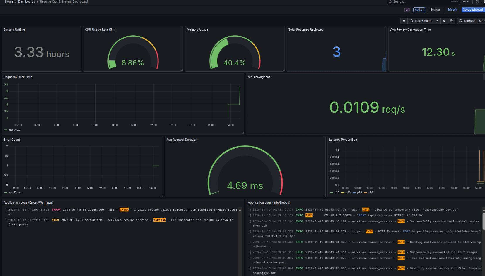
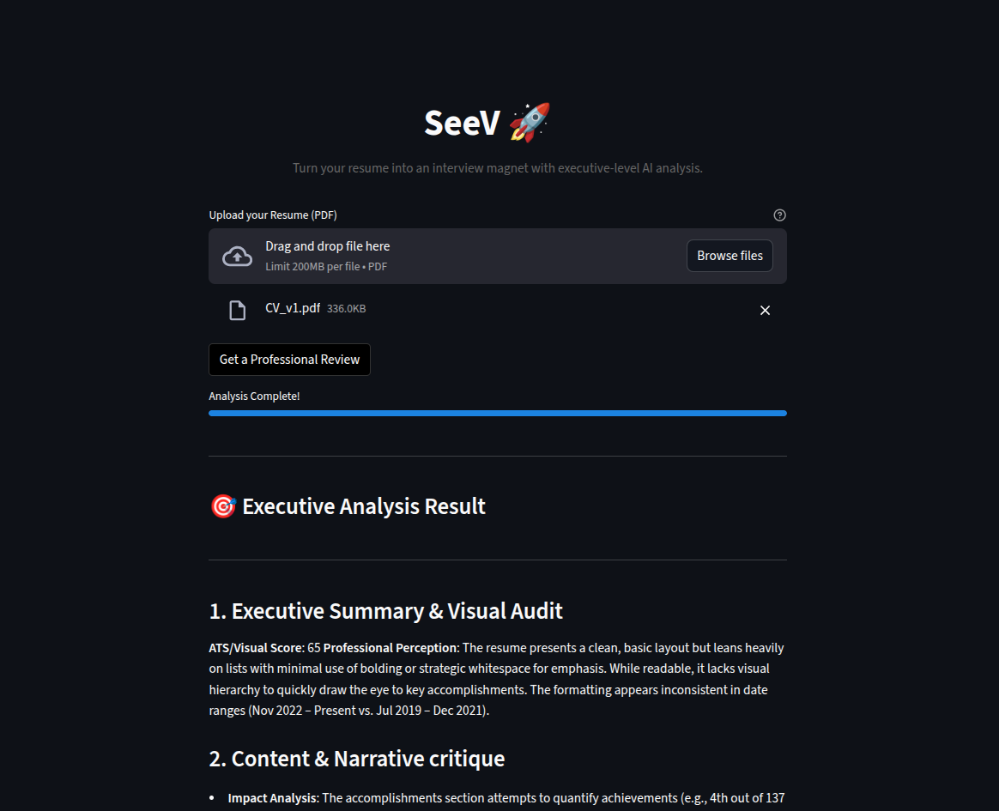

# Resume Reviewer (AI + Observability)

A production-minded resume review system that combines **multimodal AI** (PDF → images + LLM), a **low-latency text-first pipeline** (PDF text extraction → LLM), and a full **DevOps/observability stack** (Prometheus + Grafana + Loki) running via Docker Compose.

**Live Demo :** http://resume-reviewer.koreacentral.cloudapp.azure.com/
<!-- Demonstrating practical skills across:
- **AI engineering**: multimodal prompting, latency-driven pipeline design, guardrails (invalid document detection)
- **Backend engineering**: FastAPI file upload API, async-safe CPU/IO handling, structured error handling
- **DevOps/observability**: containerized stack, Prometheus metrics, Grafana dashboards, Loki log aggregation
 -->
---

<p align="center">
  
  
</p>

## What it does

- Upload a PDF resume (via Streamlit UI or API)
- Runs a **2-stage review pipeline**:
  1. **Text-first**: extract + clean text from PDF, send to LLM for content/ATS review (fast path)
  2. **Fallback to vision**: convert PDF pages to images and send to a multimodal LLM for layout/formatting critique
- If the upload is **not a resume** (e.g., a technical manual), the system returns a **422** with a clear message.

---

## Architecture

**Runtime services (Docker Compose)**
- **Backend**: FastAPI API (`/api/v1/review`, `/health`, `/metrics`)
- **Frontend**: Streamlit UI
- **Prometheus**: metrics scraping + storage
- **Grafana**: dashboards (metrics + logs)
- **Loki + Promtail**: centralized log aggregation
- **Node Exporter**: host/system metrics

See docker composition in [docker-compose.yml](docker-compose.yml).

---


---

## Benchmarking findings (latency tradeoffs)

The [CLI_Benchmarking](CLI_Benchmarking) folder contains scripts used to compare extraction strategies and model latency.

### ⏱️ Key Takeaways: Gemma 3 (27B) vs LLaMA 3.3 (70B)

| # | Extraction Method              | Preprocessing Time (s) | LLM Model                                   | LLM Review Time (s) | Notes |
|---|--------------------------------|-------------------------|---------------------------------------------|---------------------|-------|
| 1 | OCR Extraction                 | 46.74                   | llama-3.3-70b-instruct   | 22.10               | ❌ Worst overall latency |
| 2 | Standard Text Extraction       | 0.02                    | llama-3.3-70b-instruct   | 23.73               | ⚡ Fastest pipeline, poor formatting awareness |
| 3 | PDF → 1 Image                  | 0.15                    | gemma-3-27b-it                       | 32.39               | Better layout understanding |
| 4 | PDF → 2 Images                 | 0.34                    | gemma-3-27b-it                            | 34.12               | Higher latency, improved spatial context |
| 5 | Standard Text Extraction       | 0.01                    | gemma-3-27b-it                       | **18.97**           | 🏆 Fastest LLM inference |

---


<!-- Key takeaways from [CLI_Benchmarking/comparison.md](CLI_Benchmarking/comparison.md):
- **OCR is expensive**: ~46s just to extract text (worst-case)
- **Standard PDF text extraction is extremely fast**: ~0.01–0.02s
- **PDF → images is fast** (sub-second conversion), but multimodal LLM calls can be slower than text-only -->

### This is why the backend is designed as **text-first with multimodal fallback**.
---

## AI/ML engineering highlights

### Two-stage latency-optimized pipeline
- **Text extraction** uses PyMuPDF (fast for selectable text PDFs)
- If extracted text is too short (common for scanned PDFs), the service falls back to **PDF → images** and uses a multimodal model

### Guardrails: invalid resume detection
- The prompts include a strict “invalid document sentinel” response.
- The backend additionally applies **defensive detection** for common model non-compliance phrases (e.g., “this document is not a resume”).

---

## DevOps + Observability highlights

### Prometheus Custom metrics
- `resume_reviews_total{status=...}` (Counter)
- `review_generation_seconds` (Histogram)
- `uploaded_file_size_bytes` (Histogram)

Plus auto-instrumented HTTP metrics via `prometheus-fastapi-instrumentator` and system metrics via Node Exporter.

### Grafana dashboards
- Dashboard JSON lives in [grafana/dashboards/resume_ops.json](grafana/dashboards/resume_ops.json)
- Includes system health (CPU/memory/uptime), API performance (throughput, error rates, latency percentiles), and app KPIs (total reviews, avg review time)

### Loki centralized logging
- Promtail scrapes Docker container logs (non-blocking) and ships to Loki
- Grafana includes dedicated LogQL panels for Info/Debug and Error/Warn streams
---

## Quick start (local)

### 1) Configure environment
Create a `.env` file with:

```bash
OPENROUTER_API_KEY=...  # required
```

### 2) Start everything

```bash
docker compose up -d --build
```

### 3) Open services
- Streamlit UI: http://localhost:8501
- Backend API: http://localhost:8000
- Grafana: http://localhost:3000 (admin/admin)
- Prometheus: http://localhost:9090
- Loki: http://localhost:3100

---

## API usage

Upload a PDF resume:

```bash
curl -X POST http://localhost:8000/api/v1/review \
  -F "file=@your_resume.pdf"
```

- Success: returns JSON with a `review` field
- Invalid resume/document: returns **HTTP 422** with a clear error message

---

## Repo map

- [app.py](app.py): FastAPI API, custom Prometheus metrics, request handling
- [services/resume_service.py](services/resume_service.py): AI pipeline (text-first + multimodal fallback), guardrails
- [streamlit_app.py](streamlit_app.py): Streamlit UI
- [grafana](grafana): dashboards + provisioning
- [prometheus](prometheus): Prometheus scrape config
- [loki](loki), [promtail](promtail): log aggregation configs
- [CLI_Benchmarking](CLI_Benchmarking): extraction + model benchmarking utilities

---

## Learnings

This project emphasizes production signals over demos:
- **Latency-driven design** (fast text path + multimodal fallback)
- **Operational visibility** (metrics + logs + dashboards, not just prints)
- **Reliability patterns** (guardrails for invalid inputs, clear error semantics)
- **Container-first** local environment that mirrors real deployments

---

## Next steps

- Turn this into a **job recommendation agent** using job description and resume contents 
- Add alerting (Grafana alert rules) for error rate and latency regressions
- Add persistence volumes for Loki/Prometheus for longer retention
