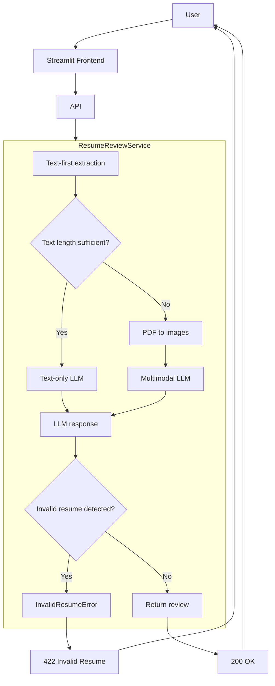
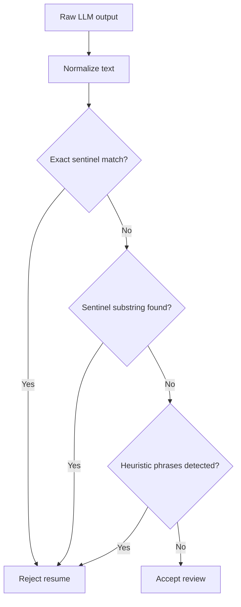
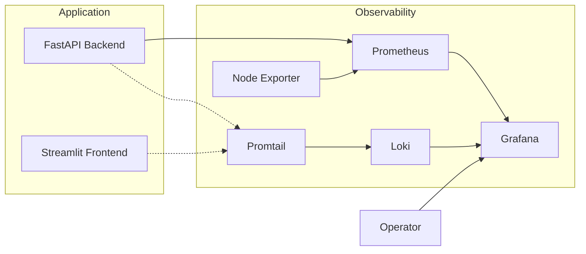

## Resume Review FLOWCHART

```mermaid
flowchart TD
  U[User] --> UI[Streamlit Frontend]
  UI --> API

  subgraph ResumeReviewService
    A[Text-first extraction] --> B{Text length sufficient?}

    B -- Yes --> T1[Text-only LLM]
    B -- No --> I0[PDF to images]

    I0 --> I1[Multimodal LLM]

    T1 --> R[LLM response]
    I1 --> R

    R --> G{Invalid resume detected?}
    G -- Yes --> ERR[InvalidResumeError]
    G -- No --> OK[Return review]
  end

  API --> ResumeReviewService
  OK --> API_OK[200 OK]
  ERR --> API_BAD[422 Invalid Resume]

  API_OK --> U
  API_BAD --> U
```

## Guardrail Flowchart

```mermaid
flowchart TD
  R[Raw LLM output] --> N[Normalize text]

  N --> S{Exact sentinel match?}
  S -- Yes --> BAD[Reject resume]

  S -- No --> C{Sentinel substring found?}
  C -- Yes --> BAD

  C -- No --> H{Heuristic phrases detected?}
  H -- Yes --> BAD

  H -- No --> GOOD[Accept review]
```

## Observibility Flowchart

```mermaid
flowchart LR
  subgraph Application
    B[FastAPI Backend]
    F[Streamlit Frontend]
  end

  subgraph Observability
    P[Prometheus]
    G[Grafana]
    L[Loki]
    PT[Promtail]
    NE[Node Exporter]
  end

  B --> P
  NE --> P
  P --> G

  B -.-> PT
  F -.-> PT
  PT --> L
  L --> G

  User[Operator] --> G
```